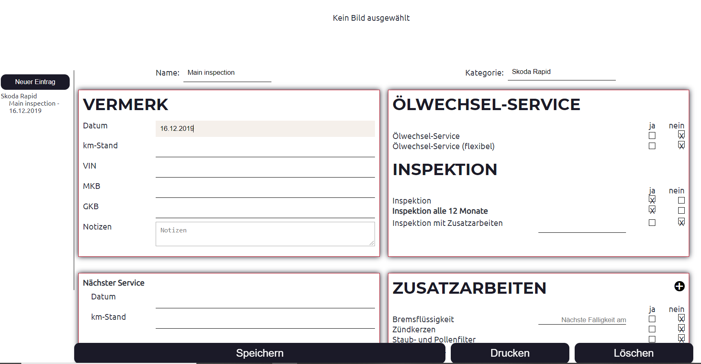

# TODO
Currently I am writing cypress UI tests for many parts of the software. When I am ready, I am going to introduce typescript. Then I will rewrite the application to use `jb-react-components` and restructure the code.

# Test
Feel free to test the app at https://gabbersepp.github.io/service-history/

# Demo

